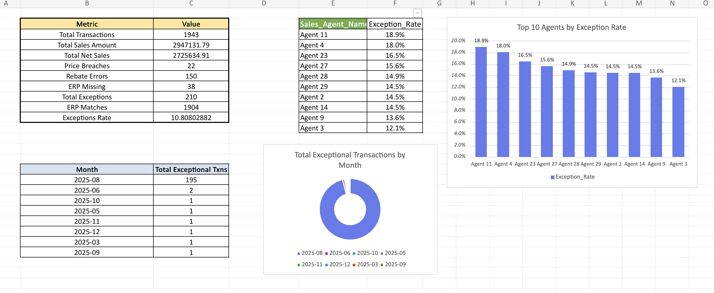

# CRM-ERP Sales Reconciliation

_Validating sales transactions across CRM and ERP systems, detecting anomalies, and ensuring rebate and incentive accuracy using Excel and Power BI._

---

## Table of Contents
- [Overview](#overview)
- [Business Problem](#business-problem)
- [Objectives](#objectives)
- [Dataset](#dataset)
- [Tools & Technologies](#tools--technologies)
- [Methodology](#methodology)
- [Validation Rules](#validation-rules)
- [Key Metrics & KPIs](#key-metrics--kpis)
- [Deliverables](#deliverables)
- [How to Use This Project](#how-to-use-this-project)
- [Key Findings](#key-findings)
- [Author & Contact](#author--contact)

---

## Overview

This project reconciles sales transactions between CRM and ERP systems to identify discrepancies, pricing violations, rebate errors, and incentive miscalculations. The analysis ensures data integrity, compliance, and accurate financial reporting[file:2].

---

## Business Problem

Organizations face significant challenges when CRM and ERP systems produce conflicting sales data, leading to:
- Pricing violations and discount breaches
- Incorrect rebate allocations
- Duplicate or fraudulent transactions
- Miscalculated sales agent incentives

These issues impact profitability, compliance, and stakeholder trust in financial reporting[file:2].

---

## Objectives

- **Data Validation**: Standardize dates and IDs, remove duplicates, ensure mandatory fields are populated
- **Anomaly Detection**: Compare CRM vs ERP transactions to flag mismatches, discount breaches, and rebate errors
- **Rebate & Incentive Accuracy**: Apply category-based rebates (A=5%, B=10%, C=0%) and calculate incentives at 2% of net sales
- **Reporting & Visualization**: Build KPI dashboards, exception reports, and trend analysis by month, product, and agent[file:2]

---

## Dataset

The project uses the following datasets:

| File | Description |
|------|-------------|
| `erp_transactions.csv` | Posted transactions from ERP (system of record) |
| `crm_transactions.csv` | CRM transactions after cleaning and deduplication |
| `products.csv` | Product master data |
| `customers.csv` | Customer master data |
| `price_list.csv` | Standard pricing reference |
| `rebate_policy.csv` | Category-based rebate rules |
| `incentive_policy.csv` | Sales agent incentive rules |
| `sales_agents.csv` | Sales agent information |
| `calendar_month.csv` | Calendar dimension for time analysis |
| `policies_and_rules.txt` | Validation rules documentation |

[file:2]

---

## Tools & Technologies

- **Microsoft Excel** (Power Query, DAX, Pivot Tables)
- **Power BI** (Interactive dashboards and visualizations)
- **GitHub** (Version control and project documentation)

[file:2]

---

## Methodology

1. **Data Integration** – Combined CRM, ERP, and master datasets in Excel/Power BI
2. **Data Cleaning** – Standardized CRM data, removed duplicates, validated mandatory IDs
3. **Validation Rules Applied** – Implemented business rules for pricing, rebates, and incentives
4. **Exception Reporting** – Identified missing ERP matches, rebate errors, blank IDs, and discount breaches
5. **Analytics & Dashboards** – Built KPI dashboard, exception reports, and trend analysis using Power BI[file:2]

---

## Validation Rules

- Transaction IDs must be unique
- Customer_ID and Product_ID are mandatory fields
- ERP unit prices must match Price List exactly
- CRM transactions flagged if Unit Price < 75% of Price List (discount breach)
- Rebates applied by product category: A (5%), B (10%), C (0%)
- Sales incentives calculated at 2% of net sales[file:2]

---

## Key Metrics & KPIs

The dashboard tracks the following metrics:
- **Total Transactions**: Count of all transactions processed
- **Total Sales**: Aggregate sales value from ERP and CRM
- **Net Sales**: Sales after rebates and discounts
- **Price Breaches**: Transactions violating pricing rules
- **Rebate Errors**: Incorrect rebate calculations
- **Exceptions**: Transactions requiring manual review
- **ERP Missing**: CRM transactions without ERP match
- **ERP Matches**: Successfully reconciled transactions
- **Match Rate**: Percentage of successful reconciliations[memory:1]

---
## Dashboard

The Power BI dashboard provides interactive visualizations for monitoring reconciliation metrics, agent performance, and exception trends.

### KPI Dashboard Overview

**Key Features:**
- **Summary Metrics Panel**: Displays total transactions, sales amounts, net sales, and exception counts
- **Top 10 Agents by Exception Rate**: Bar chart ranking agents with highest exception rates (Agent 11: 18.9%, Agent 4: 18.0%, Agent 23: 16.5%)
- **Sales Agent Performance Table**: Lists top agents with their respective exception rates
- **Monthly Exception Trends**: Donut chart showing distribution of exceptional transactions across months (2025-08 to 2025-12)
- **Exception Analysis by Month**: Tabular breakdown of exceptional transactions per month

The dashboard enables stakeholders to quickly identify high-risk agents, monitor compliance trends, and prioritize exception resolution.

---

## Deliverables

- **Cleaned CRM Dataset** with anomaly flags
- **Rebate & Incentive Calculations** at transaction and agent levels
- **Exception Reports** for anomalies, mismatches, and compliance breaches
- **Excel Workbook** (Worksheet.xlsx) with pivots, KPIs, and trend analysis
- **Power BI Dashboard** (SalesDifference.pbix) for interactive visualization[file:2]

---

## How to Use This Project

1. **Clone the repository:**
git clone https://github.com/vasiq8/crm-erp-sales-reconciliation.git

2. **Navigate to the data folder** and review the raw data files

3. **Open the Excel workbook:**
   - `analysis/Worksheet.xlsx` contains all calculations, pivots, and KPIs

4. **Open the Power BI dashboard:**
   - `dashboard/SalesDifference.pbix` for interactive visualizations

5. **Review documentation:**
   - `documentation/README.docx` for detailed project context

---

## Key Findings

- Identified **3.4% variance** between ERP (3.04M) and CRM (2.94M) sales totals
- Detected **pricing violations** where CRM prices fell below 75% of standard price list
- Flagged **rebate errors** due to incorrect category assignments
- Highlighted **high-risk agents** with frequent exceptions and compliance breaches
- Provided **actionable insights** through clear KPIs and visual dashboards for stakeholder decision-making[file:2][memory:1]

---

## Author & Contact

**Vasiq**  
 Email: vasiq.8@gmail.com  
 Phone: 8385898989  

